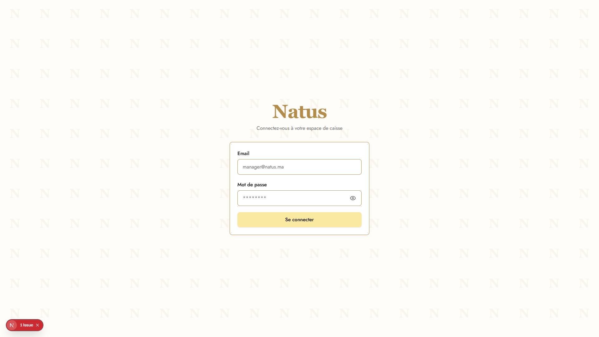

# Natus POS — Guide des rôles (document client)

**Plateforme :** Natus POS — Marrakech  
**Version :** 0.1.0  
**Public :** Direction Natus, gérants, équipes magasin, hub logistique, livreurs  
**Complément technique :** voir [PLATFORM.md](../PLATFORM.md)

---

## Introduction

Natus POS est la plateforme unique qui regroupe :

- la **caisse en magasin** (ventes, scan, fidélité) ;
- la **gestion des commandes web Shopify** (préparation, livraison, retours) ;
- la **logistique hub** (transferts de stock entre entrepôt et magasins) ;
- le **programme fidélité** (carte digitale, points, réductions) ;
- le **marketing WhatsApp** (confirmations, statuts, avis clients) ;
- les **outils de direction** (tableaux de bord, utilisateurs, réclamations).

Chaque collaborateur se connecte avec **son propre compte**. L’interface s’adapte automatiquement à son **rôle** et à son **magasin / ville**.

**Connexion :** https://votre-domaine.natus.ma/login

---

## Vue d’ensemble des rôles

| Rôle | Qui ? | Périmètre | Appareil recommandé |
|------|-------|-----------|---------------------|
| **Directeur** | Direction, propriétaire | Tous les magasins, toutes les villes | Ordinateur |
| **Administrateur** | IT / super-admin | Identique au directeur | Ordinateur |
| **Gérant** | Responsable de magasin ou de ville | Magasin(s) de sa ville | Ordinateur (+ mobile consultation) |
| **Caissier** | Vendeur en boutique | Son magasin | Caisse (écran tactile / PC) + mobile planning |
| **Hub stock** | Responsable entrepôt logistique | Ville / hub assigné | Ordinateur |
| **Livreur** | Livraison commandes web | Commandes de son magasin | Smartphone |

### Schéma simplifié

```
                    ┌─────────────┐
                    │  Directeur  │
                    │  / Admin    │
                    └──────┬──────┘
                           │ supervise tout
         ┌─────────────────┼─────────────────┐
         ▼                 ▼                 ▼
   ┌──────────┐     ┌──────────┐      ┌──────────┐
   │  Gérant  │     │Hub stock │      │ Livreur  │
   │ (ville)  │     │(entrepôt)│      │(livraison)│
   └────┬─────┘     └────┬─────┘      └──────────┘
        │                │
        ▼                │ transferts stock
   ┌──────────┐          │
   │ Caissier │◄─────────┘
   │ (magasin)│
   └──────────┘
```

---

## Connexion à la plateforme

Tous les rôles passent par la même page de connexion.



| Champ | Description |
|-------|-------------|
| **Email** | Adresse fournie par la direction (ex. `prenom.magasin@natus.ma`) |
| **Mot de passe** | Mot de passe initial communiqué à la création du compte |

> **Sécurité :** changez votre mot de passe à la première connexion si votre administrateur l’a configuré. La session se déconnecte automatiquement après **15 minutes d’inactivité** (sauf terminal caisse magasin).

---

## 1. Directeur

### Mission

Piloter l’ensemble du réseau Natus : ventes, stocks, commandes web, fidélité, équipes et hubs logistiques.

### Accès

- **Toutes les villes** et **tous les magasins**
- Création des comptes : gérants, caissiers, livreurs, hubs
- Paramètres globaux du programme fidélité
- Vue consolidée du stock hub

### Menu principal (ordinateur)

| Section | Utilité au quotidien |
|---------|----------------------|
| **Accueil** | Tableau de bord multi-magasins, KPI ventes et stock |
| **Commandes** | Suivi commandes Shopify (tous magasins) |
| **Planning** | Planning des équipes caisse |
| **Caisse** | Accès caisse (ordinateur uniquement) |
| **Ventes** | Historique et détail des ventes |
| **Stock** | Niveaux de stock par magasin |
| **Produits** | Catalogue, variantes, codes-barres |
| **Magasins** | Fiches magasins |
| **Hub stock** | Vue globale entrepôt |
| **Hubs** | Gestion des comptes hub logistique |
| **Activité** | Journal des mouvements (ventes, stock) |
| **Réclamations** | Plaintes clients (web + magasin) |
| **Fidélité** | Clients, points, paramètres programme |
| **Factures** | Factures émises |
| **Actualités** | Annonces internes réseau |
| **Utilisateurs** | Création et gestion des comptes |

### Tâches typiques

1. Consulter le tableau de bord et comparer les magasins
2. Valider une réclamation client
3. Ajuster le stock total ou un code-barre produit
4. Créer un compte gérant ou hub pour une nouvelle ville
5. Paramétrer les seuils fidélité (points → réduction)
6. Superviser les transferts hub → magasins

### Mobile

| Fonction | Mobile |
|----------|--------|
| Tableau de bord, commandes, stock | ✅ Consultation |
| **Caisse POS** | ❌ Réservé ordinateur |
| Navigation | 4 raccourcis + menu « Plus » |

### Capture d’écran

> Ajouter : `screenshots/01-directeur-dashboard.png`  
> Se connecter avec le compte directeur → page **Accueil** (`/director`).

---

## 2. Administrateur

### Mission

Même périmètre que le **Directeur** pour l’exploitation quotidienne de la plateforme. Le rôle est prévu pour un profil technique ou un super-utilisateur.

### Différences mineures avec le Directeur

- Label affiché « **Administrateur** » dans l’interface
- Mêmes menus et mêmes droits d’accès (`/director`)
- Certaines actions sensibles (ex. édition code-barre) peuvent être réservées au libellé « Directeur » selon la configuration

### Capture d’écran

> Ajouter : `screenshots/02-admin-accueil.png`  
> Identique visuellement au directeur — page `/director`.

---

## 3. Gérant

### Mission

Gérer **son magasin** (ou les magasins de **sa ville**) : ventes, stock, équipe, commandes web et relation client.

### Accès

- Magasins de **sa ville uniquement**
- Création de comptes **caissier** et **livreur** (pas de gérant ni hub)
- Réclamations, fidélité, factures de son périmètre

### Menu principal

| Section | Utilité au quotidien |
|---------|----------------------|
| **Accueil** | KPI du magasin sélectionné |
| **Commandes** | Préparer / expédier commandes Shopify |
| **Planning** | Planifier shifts et repos des caissiers |
| **Caisse** | Encaisser (ordinateur) |
| **Ventes** | Suivi ventes magasin |
| **Stock** | Réappro, ajustements, alertes rupture |
| **Produits** | Consultation / édition catalogue magasin |
| **Magasins** | Fiches magasins ville |
| **Activité** | Historique opérations |
| **Réclamations** | Traiter les plaintes |
| **Fidélité** | Fiches clients, attribution points |
| **Factures** | Télécharger / consulter factures |
| **Actualités** | Publier infos équipe |
| **Utilisateurs** | Gérer caissiers et livreurs du magasin |

### Tâches typiques

1. Ouvrir le magasin : vérifier stock et commandes du jour
2. Assigner le planning de la semaine
3. Traiter une commande web (statut → prête → expédiée)
4. Répondre à une réclamation
5. Annuler une vente caisse (droit gérant, règles 24 h)
6. Demander un transfert au hub si rupture

### Mobile

| Fonction | Mobile |
|----------|--------|
| Commandes, ventes, stock (lecture) | ✅ |
| **Caisse POS** | ❌ Ordinateur uniquement |
| Réclamations, fidélité | ✅ via menu « Plus » |

### Captures d’écran

> Ajouter :  
> - `screenshots/03-gerant-dashboard.png` — Accueil `/manager`  
> - `screenshots/04-gerant-commandes.png` — Commandes Shopify  
> - `screenshots/05-gerant-planning.png` — Planning équipe

---

## 4. Caissier

### Mission

Accueillir le client en boutique : vente en caisse, fidélité, commandes web à retirer, notes clients.

### Types de comptes caissier

| Type | Description | Usage |
|------|-------------|-------|
| **Caissier personnel** | Compte individuel (ex. Oussal, Hajar) | Ventes au nom du vendeur |
| **Caisse magasin** | Terminal partagé (`caisse.magasin@natus.ma`) | Écran fixe en boutique ; identification par **badge NFC** |

### Menu principal

| Section | Utilité au quotidien |
|---------|----------------------|
| **Caisse** | Terminal POS — cœur du métier |
| **Planning** | Voir ses shifts et jours de repos |
| **Commandes** | Commandes web à préparer / remettre |
| **Actualités** | Infos direction / magasin |
| **Ventes** | Historique de ses ventes |
| **Notes** | Notes clients (fidélité, préférences) |
| **Hub** | Demander du stock à l’entrepôt |
| **Fidélité** | Rechercher client, voir carte et points |
| **Retours** | Enregistrer un retour produit |
| **Factures** | Rééditer une facture client |

### Caisse POS — fonctions clés

1. **Scanner** un code-barres ou rechercher un produit
2. Ajouter au **panier**, modifier quantités
3. Associer un **client fidélité** (scan carte QR ou téléphone)
4. Appliquer **points fidélité** et/ou **code promo**
5. Encaisser **espèces** ou **carte** (calcul monnaie intégré)
6. Encaisser une **commande Shopify** préparée
7. Imprimer **ticket** ou **facture**
8. **Annuler** une vente (délai 24 h, règles caissier)

### Mobile

| Profil | Mobile |
|--------|--------|
| Caissier standard | ✅ Caisse + tous les menus |
| Caissier dont le magasin a un terminal POS | 📅 **Planning uniquement** sur téléphone |
| Compte « caisse magasin » | 📅 Planning sur mobile ; caisse sur **PC fixe** |

### Captures d’écran

> Ajouter :  
> - `screenshots/06-caissier-pos.png` — Terminal `/cashier/pos`  
> - `screenshots/07-caissier-fidelite.png` — Client fidélité  
> - `screenshots/08-caissier-planning.png` — Planning mobile

---

## 5. Hub stock

### Mission

Gérer l’**entrepôt central** : stock hub, envois vers les magasins, suivi des demandes caissiers/gérants.

### Accès

- Ville et magasins **assignés** au hub
- Édition du **stock total** (comme le directeur sur son périmètre)
- Pas d’accès caisse ni gestion utilisateurs

### Menu principal

| Section | Utilité au quotidien |
|---------|----------------------|
| **Accueil** | Vue d’ensemble : gérants liés, magasins, caissiers |
| **Stock** | Stock par magasin de la ville |
| **Entrepôt** | Stock central + **envoi vers un magasin** |
| **Activité** | Mouvements logistiques |
| **Actualités** | Infos réseau |

### Tâche type : envoyer du stock à un magasin

1. Aller dans **Entrepôt** (`/hub/hub-stock`)
2. Sélectionner le **magasin destination**
3. Saisir les quantités produit par produit
4. Ajouter une **note** optionnelle (ex. « Réapprovisionnement Guéliz »)
5. Cliquer **Transférer** — le stock est débité du hub et crédité au magasin

### Mobile

| Fonction | Mobile |
|----------|--------|
| Consultation stock | ✅ |
| Transferts entrepôt | ✅ (écran adapté) |
| **Caisse** | ❌ Non accessible |

### Captures d’écran

> Ajouter :  
> - `screenshots/09-hub-accueil.png` — `/hub`  
> - `screenshots/10-hub-entrepot.png` — Formulaire transfert `/hub/hub-stock`

---

## 6. Livreur

### Mission

Livrer les **commandes web Shopify** assignées à son magasin : prise en charge, livraison, retour avec motif.

### Menu principal

| Section | Utilité |
|---------|---------|
| **Livraisons** | Liste des commandes à livrer |
| **Actualités** | Infos magasin / réseau |
| **Retours** | Historique et saisie retours |

### Tâches typiques

1. Ouvrir **Mes livraisons** le matin
2. Filtrer les commandes **prêtes** / **en livraison**
3. Marquer **Livré** à l’arrivée chez le client
4. En cas de problème : **Retour** avec **note obligatoire**
5. Le client reçoit un message WhatsApp (feedback ~2 h après livraison)

### Mobile

Conçu **prioritairement pour smartphone** : interface simplifiée, 3 entrées dans la barre du bas.

### Captures d’écran

> Ajouter :  
> - `screenshots/11-livreur-livraisons.png` — `/livreur/orders`  
> - `screenshots/12-livreur-retours.png` — `/livreur/returns`

---

## 7. Espace client final (public, sans compte staff)

Ces pages sont accessibles aux **clients Natus** via lien WhatsApp, QR ou email.

| Page | Lien type | Rôle |
|------|-----------|------|
| **Suivi commande** | `/commande/[token]` | Statut commande web en temps réel |
| **Carte fidélité** | `/carte/[token]` | Points, QR, ajout écran d’accueil |
| **Réclamation** | `/reclamation` | Formulaire plainte magasin |
| **Avis Google** | `/avis-google` | Redirection vers avis Google |
| **Fiche produit** | `/produit/[id]` | Storytelling produit (marketing) |

### Captures d’écran

> Ajouter :  
> - `screenshots/13-client-carte-fidelite.png`  
> - `screenshots/14-client-suivi-commande.png`  
> - `screenshots/15-client-reclamation.png`

---

## Matrice des permissions (résumé)

| Action | Directeur | Gérant | Caissier | Hub | Livreur |
|--------|:---------:|:------:|:--------:|:---:|:-------:|
| Voir tous les magasins | ✅ | ❌ (ville) | ❌ (sien) | ❌ (ville) | ❌ (sien) |
| Caisse POS | ✅ PC | ✅ PC | ✅ | ❌ | ❌ |
| Créer utilisateur | ✅ | Caissier/livreur | ❌ | ❌ | ❌ |
| Gérer stock magasin | ✅ | ✅ | ❌ | ✅ | ❌ |
| Stock total / entrepôt | ✅ | ❌ | ❌ | ✅ | ❌ |
| Transfert hub → magasin | ✅ | ❌ | ❌ | ✅ | ❌ |
| Réclamations | ✅ | ✅ | ❌ | ❌ | ❌ |
| Paramètres fidélité | ✅ | ✅ | ❌ | ❌ | ❌ |
| Livraison commande | ✅ | ✅ | ❌ | ❌ | ✅ |
| Planning équipe | ✅ | ✅ | Lecture | ❌ | ❌ |

---

## Notifications et WhatsApp

| Événement | Qui est notifié ? | Canal |
|-----------|-------------------|-------|
| Nouvelle commande web | Gérant / caisse (cloche app) | App + WhatsApp client |
| Stock bas | Caisse / gérant | Cloche dans l’app |
| Changement statut commande | Client | WhatsApp |
| Après livraison | Client | WhatsApp (demande d’avis) |
| Client inactif 60 j | Client | WhatsApp win-back (code promo) |
| Message entrant client | Bot Gemini | WhatsApp → réponses auto |

> Sur **mobile**, la cloche de notification est visible en priorité dans la **caisse**. Pour les gérants sur téléphone, privilégier la consultation des **Commandes**.

---

## Bonnes pratiques par magasin

### Ouverture

- [ ] Gérant : vérifier commandes **en attente** et stock critique
- [ ] Caissier : ouvrir la **caisse** ou badger sur le **terminal NFC**
- [ ] Hub : traiter les demandes de transfert de la veille

### Pendant la journée

- [ ] Scanner systématiquement les produits (traçabilité stock)
- [ ] Proposer la **carte fidélité** à chaque client
- [ ] Mettre à jour le statut des commandes web

### Fermeture

- [ ] Contrôler les ventes du jour (`Ventes`)
- [ ] Vérifier qu’aucune commande n’est bloquée en « Prête »
- [ ] Signaler les ruptures au hub

---

## Comptes de démonstration (environnement test)

| Rôle | Email exemple | Mot de passe |
|------|---------------|--------------|
| Directeur | `directeur@natus.ma` | `Natus2026!` |
| Administrateur | `admin@natus.ma` | `Natus2026!` |
| Gérant Marrakech | `manager.marrakech@natus.ma` | `Natus2026!` |
| Hub Marrakech | `hub.marrakech@natus.ma` | `Natus2026!` |
| Caisse magasin | `caisse.natus.gueliz@natus.ma` | `Natus2026!` |
| Caissier | `oussal.natus.gueliz@natus.ma` | `Natus2026!` |
| Livreur | `livreur.natus.gueliz@natus.ma` | `Natus2026!` |

> ⚠️ Ne pas utiliser ces identifiants en production. À désactiver ou changer avant mise en ligne client.

---

## Comment compléter les captures d’écran

1. Créer le dossier `docs/guide-client/screenshots/` (déjà présent).
2. Se connecter avec chaque compte ci-dessus.
3. Capturer l’écran (Windows : `Win + Shift + S`, Mac : `Cmd + Shift + 4`).
4. Nommer les fichiers comme indiqué dans chaque section (`01-directeur-dashboard.png`, etc.).
5. Les images s’affichent automatiquement dans ce document Markdown.

**Résolution conseillée :** 1440×900 (desktop) ou 390×844 (mobile iPhone).

---

## Support

| Besoin | Contact |
|--------|---------|
| Nouveau compte / mot de passe oublié | Directeur ou administrateur Natus |
| Problème technique plateforme | Support technique (équipe dev) |
| Réclamation client en magasin | Gérant via **Réclamations** |
| Réclamation client web | Lien `/reclamation` |

---

*Document préparé pour Natus Cosmétiques — Marrakech*  
*Dernière mise à jour : juin 2026*
